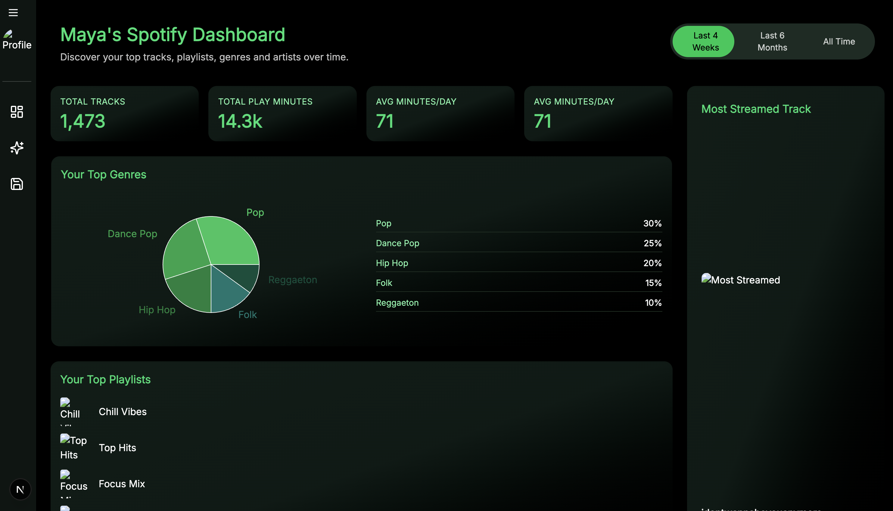

<h1 align="center">
  Spotify Listening Dashboard
</h1>

<p align="center">
  A full-stack web app that visualizes your Spotify listening history.  
  Built with <a href="https://nextjs.org/" target="_blank">Next.js 15</a>, <a href="https://www.typescriptlang.org/" target="_blank">TypeScript</a>,  
  powered by <a href="https://redux-toolkit.js.org/" target="_blank">Redux Toolkit</a>,  
  styled with <a href="https://tailwindcss.com/" target="_blank">Tailwind CSS</a> + <a href="https://ui.shadcn.com/" target="_blank">shadcn/ui</a>,  
  and integrated with the <a href="https://developer.spotify.com/documentation/web-api/" target="_blank">Spotify Web API</a> via OAuth2 Authentication.
</p>

<p align="center">
  
</p>


## Features
- **Spotify OAuth2 Authentication** – secure login with your Spotify account  
- **Top Artists, Tracks, and Playlists** – fetched directly from the Spotify Web API  
- **Genre Insights** – pie chart and line chart breakdown of your top genres across time ranges  
- **Most Streamed Track** – highlights your most played track per time range  
- **Summary Cards** – total tracks, minutes listened, and averages  
- **Responsive UI** – mobile-friendly, clean design with Tailwind + shadcn/ui components  
- **Modern Animations** – powered by Framer Motion for smooth transitions  

## Tech Stack
- **Frontend:** Next.js 15 (App Router), React, TypeScript, Tailwind CSS, shadcn/ui, Recharts, Framer Motion  
- **State Management:** Redux Toolkit, Async Thunks  
- **Backend:** Node.js, Express, Axios  
- **Deployment:** Vercel (frontend), Render (backend)  
- **APIs:** Spotify Web API  

## Live Demo
- Spotify Dashboard – Deployed Frontend](https://your-vercel-app.vercel.app)  
- [Backend API on Render](https://your-backend.onrender.com)  


## Installation & Setup

### 1. Clone the repository
```bash
git clone https://github.com/your-username/spotify-dashboard.git
cd spotify-dashboard
```

### 2. Install dependencies

**Frontend:**

```bash
cd frontend
npm install
```

**Backend:**

```bash
cd ../backend
npm install
```

### 3. Setup environment variables

Create a .env file in backend/ with:

```bash
SPOTIFY_CLIENT_ID=your-spotify-client-id
SPOTIFY_CLIENT_SECRET=your-spotify-client-secret
SPOTIFY_REDIRECT_URI=http://localhost:4000/auth/callback
FRONTEND_URL=http://localhost:3000
PORT=4000
```

Create a .env.local file in frontend/ with:

```bash
NEXT_PUBLIC_BACKEND_URL=http://localhost:4000
```

### 4. Run development servers

**Frontend (Next.js):** 

```bash
cd frontend
npm run dev
```

Open http://localhost:3000

**Backend (Express):**

```bash
cd backend
npm run dev
```

Runs on http://localhost:4000

### Future Improvements

- Add Playlists tab 
- Export data visualizations as shareable images

### Contributing

Feel free to fork this repository and submit pull requests.
You are welcome to give feature suggestions.

### License

This project is licensed under the MIT License.
You are free to use, modify, and distribute this project with attribution.
